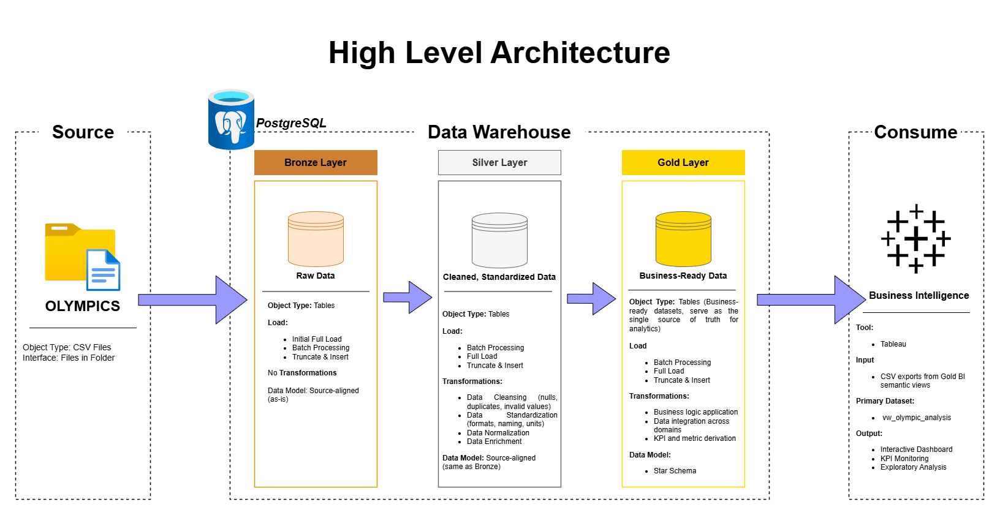
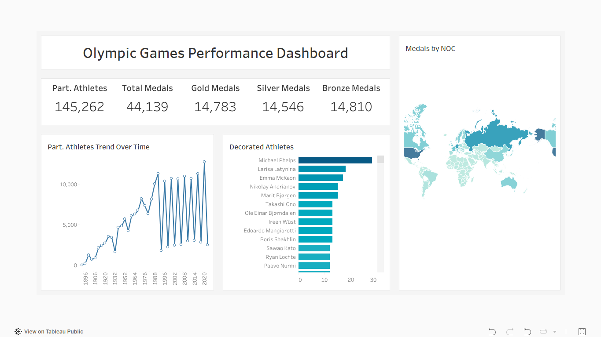

# 🏅 Olympic Data Warehouse & Analytics Project

Welcome to the **Olympic Data Warehouse & Analytics Project**
This repository demonstrates an end-to-end **modern data warehousing solution**, from raw data ingestion to analytics-ready datasets designed for Business Intelligence (BI) tools.

The project focuses on **data engineering best practices**, including medallion architecture, star schema modeling, data quality validation, and a semantic BI layer built for interactive analytics.

While inspired by modern data warehouse design patterns shared by industry practitioners, this project is a **fully original implementation**, tailored specifically to Olympic Games analytics.

---

## 📌 Project Contributors & Credits

This project builds upon publicly available resources and community knowledge:

- **Reymart Felisilda** - Data Warehouse Design, ETL Development, Data Modeling, BI Semantic Layer
- **Keith Galli** - Original Olympic datasets (scraped from official Olympic sources)
- **Baraa Khatib Salkini** - Architectural inspiration and modern data warehouse concepts
- **Andy Kriebel** - BI and Tableau dashboard design inspiration

> ⚠️ ALL SQL scripts, transformations, modeling decisions, tests, and BI views in this repository are original implementations created for this project.

---

## Project Overview

This project demonstrates:

1. **Modern Data Architecture**
   - Medallion Architecture (Bronze, Silver, Gold)
   - Clear separation of ingestion, transformation, and analytics layers

2. **ETL & Data Engineering**
   - SQL-based pipelines using PostgreSQL
   - Idempotent DDL and load procedures
   - Explicit data quality and integrity checks

3. **Dimensional Data Modeling**
   - Star schema desing
   - Fact and dimension tables optimized for analytics
  
4. **BI & Analytics Enablement**
   - Business-facing semantic views
   - Interactive, filterable analytics
   - Reproducible exports for BI tools (e.g., Tableau)

---

## 🏗️ Data Architecture

The data warehouse follows the **Medallion Architecture**, a layered approach that improves data quality, scalability, and maintainability.



### 🥉 Bronze Layer - Raw Ingestion
- Stores data **exactly as received**
- No transformations applied
- Acts as the immutable source of truth
- Data ingested from CSV files into PostgreSQL

### 🥈 Silver Layer - Cleansed & Standardized
- Data cleansing (null handling, trimming, deduplication)
- Standardization (case normalization, type casting)
- Data enrichment (derived attributes, parsed dates, locations)
- Structural transformations (e.g., reshaping)

### 🥇 Gold Layer - Analytics - Ready
- Business-ready datasets
- Star schema design (fact and dimensions)
- Optimized for analytical workloads

### 📊 Gold BI Layer - Semantic Layer
- Business-facing views
- Explicit grain per view
- Designed for BI interactivity
- No row-level mutations; aggregations only.

---

## 🧱 Data Model

The Gold layer is modeled using a **Star Schema**.

### Fact Table
- **`fact_olympic_results`**
- Grain: *One row per athlete per Olympic Games participation*

### Dimension Tables
- `dim_athletes`
- `dim_games`
- `dim_sport_events`
- `dim_nocs`

All relationship follow **1-to-many** cardinality from dimensions to fact, ensuring predictable joins and performant analytics.

---

## 📊 Analytics & Business Questions

The BI semantic layer supports analysis such as:

- Athlete participation trends over time
- Medal distribution by country (NOC)
- Most decorated Olympic athletes
- Sports with the highest athlete participation
- Medal efficiency by country

Aggregations are intentionally handled at the **semantic layer**, allowing BI tools to provide filtering, drill-downs, and interactive dashboards.

---

## 📈 Visualization & Dashboard

The insights produced by the Gold BI Semantic Layer are visualized using an interactive Tableau dashboard built on top of the exported BI views.

🔗 **Tableau Public Dashboard**

https://public.tableau.com/app/profile/reymart.felisilda/viz/olympic_games_performance_dashboard/OlympicGamesPerformanceDashboard#1

### Dashboard Highlights
- Athlete participation trends across Olympic Games
- Medal distribution by National Olympic Committee (NOC)
- Most decorated Olympic athletes

> The dashboard consumes **Gold BI semantic views**, not raw tables, ensuring
> consistent business logic, performance, and reusability across analyses.

---

## 🛠️ Tools & Technologies
- **PostgreSQL** - Core data warehouse engine
- **SQL / PLpgSQL** - ETL pipelines, testing, and exports
- **Tableau** - BI Visualization (via semantic views)
- **Draw.io** - Architecture, lineage, and modeling diagrams
- **Git & GitHub** - Version control and documentation

### Data Source
- **Olympic Dataset by Keith Galli**
  https://github.com/KeithGalli/Olympics-Dataset
  
> Even datasets described as "clean" are treated as **raw inputs** and fully reprocessed to ensure consistency and transparency.

---

## 📂 Repository Structure

```text
olympic-data-warehouse/
│
├── datasets/
│   └── source_olympics/              # Raw Olympic CSV datasets (external source)
│
├── docs/                             # Architecture, diagrams, and documentation
│   ├── data_architecture.png
│   ├── data_models.png
│   ├── data_flow.png
│   ├── data_catalog.md
│   ├── olympic_dashboard_preview.png
│   └── naming_conventions.md
│
├── scripts/
│   ├── init_database.sql             # Database & schema initialization
│   ├── bronze/                       # Raw ingestion layer
│   ├── silver/                       # Cleansing and transformation layer
│   ├── gold/                         # Star schema (facts & dimensions)
│   └── gold_bi/                      # BI semantic views and exports
│
├── exports/
│   └── export_gold_bi_views.sql      # CSV export procedure for BI tools
│
├── tests/
│   ├── quality_checks_silver.sql     # Silver layer data quality validation
│   └── quality_checks_gold.sql       # Gold layer integrity & schema validation
│
├── README.md                         # Project overview
└── LICENSE
```

---

## 🛡️ License

This project is licensed under the [MIT License](LICENSE).
You are free to use, modify, and distribute this project with proper attribution.

---

## 👋 About Me
Hi. I'm Reymart Felisilda
A Mechanical Project Engineer upskilling into Data Engineering, with a strong focus on:
- Data Warehousing
- SQL & Analytics Engineering
- Dimensional Modeling
- BI Enablement
